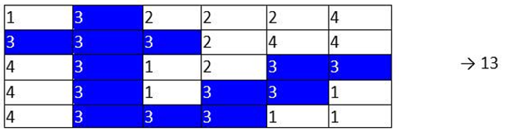

Create a program which searches the largest area of identical numbers in a matrix. Area in this case is the aggregation of two or more elements from neighbour table column or table row. Here is an example in which we have an area with 13 numbers with a value of 3:

